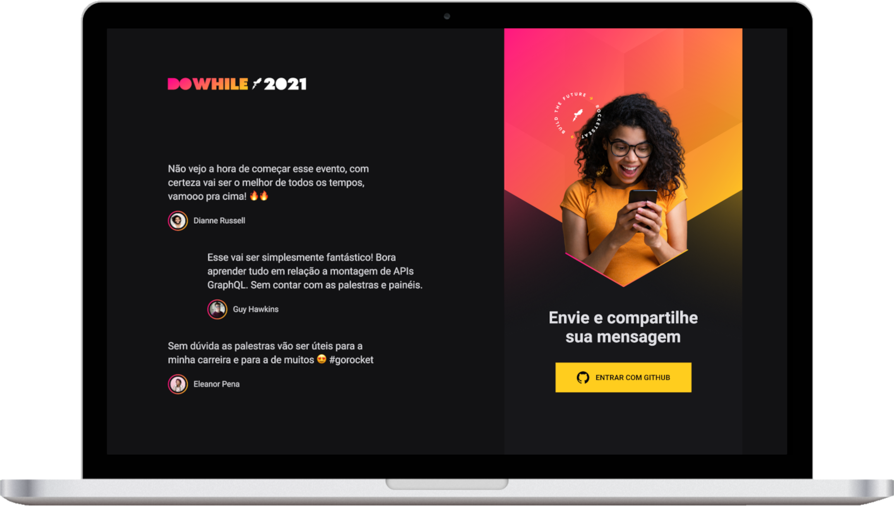

<h1 align="center">NLW Heat - Node.js</h1>

  <a href="#-tecnologias">Tecnologias</a>&nbsp;&nbsp;&nbsp;|&nbsp;&nbsp;&nbsp;
  <a href="#-como-executar">Como executar</a>&nbsp;&nbsp;&nbsp;|&nbsp;&nbsp;&nbsp;
  <a href="#-licença">Licença</a>

  
  

 

  

## ✨ Tecnologias

Esse projeto foi desenvolvido durante o Next Level Week Heat (trilha impulse), evento da escola <a href="https://www.rocketseat.com.br/">Rocketseat</a>. Foram utilizadas as seguintes tecnologias:

- [ReactJs](https://pt-br.reactjs.org/)
- [TypeScript](https://www.typescriptlang.org/)
- [Axios](https://axios-http.com/)
- [Prisma](https://www.prisma.io/)
- [Socket.IO-client](https://socket.io/docs/v4/client-api/)

 

- [React Icons](https://react-icons.github.io/react-icons/)
- [SASS](https://sass-lang.com/)

 

## 🚀 Sobre o projeto

Ansioso para o <a href="https://dowhile.io/inscricao">DoWhile</a> 2021? A aplicacão nos permite compartilhar mensagens e pensamentos sobre o evento em tempo real com a comunidade! Basta entrar com seu perfil do Github e escrever seu texto.

 

## 💻 Back-end

Confira o Back-end da aplicação:

- [Back-end](https://github.com/pwsera/nlw-heat-node)

## 📄 Licença

Esse projeto está sob a licença MIT. Veja o arquivo [LICENSE](LICENSE) para mais detalhes.

---